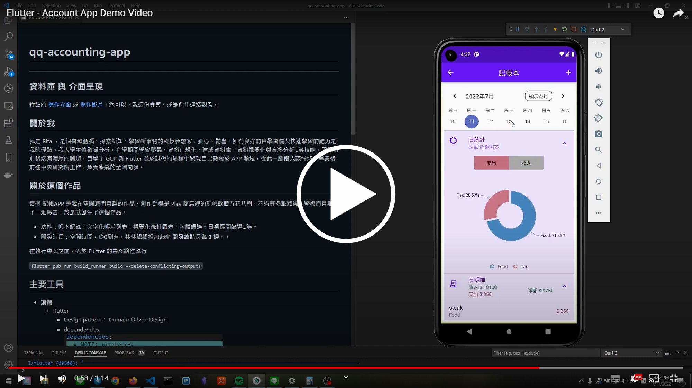

# QQ Accounting App Demo

---

## 目錄

1. [作品介紹](#作品介紹) - 快速點餐系統（Order Ease 餐點輕鬆訂）介紹。
2. [Demo 影片](#demo-影片) - 實際 APP 操作影片。
3. [技術清單](#技術清單) - 包含了使用的前端技術和相關工具的版本與清單。

## 作品介紹

### 簡介

這個 記帳 APP 是我在工作之餘的空閒時間自製的作品，創作動機是 Play 商店裡的記帳軟體五花八門，不過許多軟體操作繁複而且塞滿了一堆廣告，於是就誕生了這個作品。

- 功能：帳本記錄、文字化帳戶列表、視覺化統計圖表、字體調適、日期區間篩選...等。
- 開發時長：空閒時間，從 0 到有，林林總總相加起來 **開發總時長為 3 週**。。

在執行專案之前，先於 Flutter 的專案路徑執行

`
flutter pub run build_runner build --delete-conflicting-outputs`

## Demo 影片

## 技術清單

- **Front-end**
  - Flutter
    - Design pattern： Domain-Driven Design
    - dependencies  
      
- **Back-end**
  - SQLite
  - Firestore
- **Tools**
  - Git
  - Xmind
